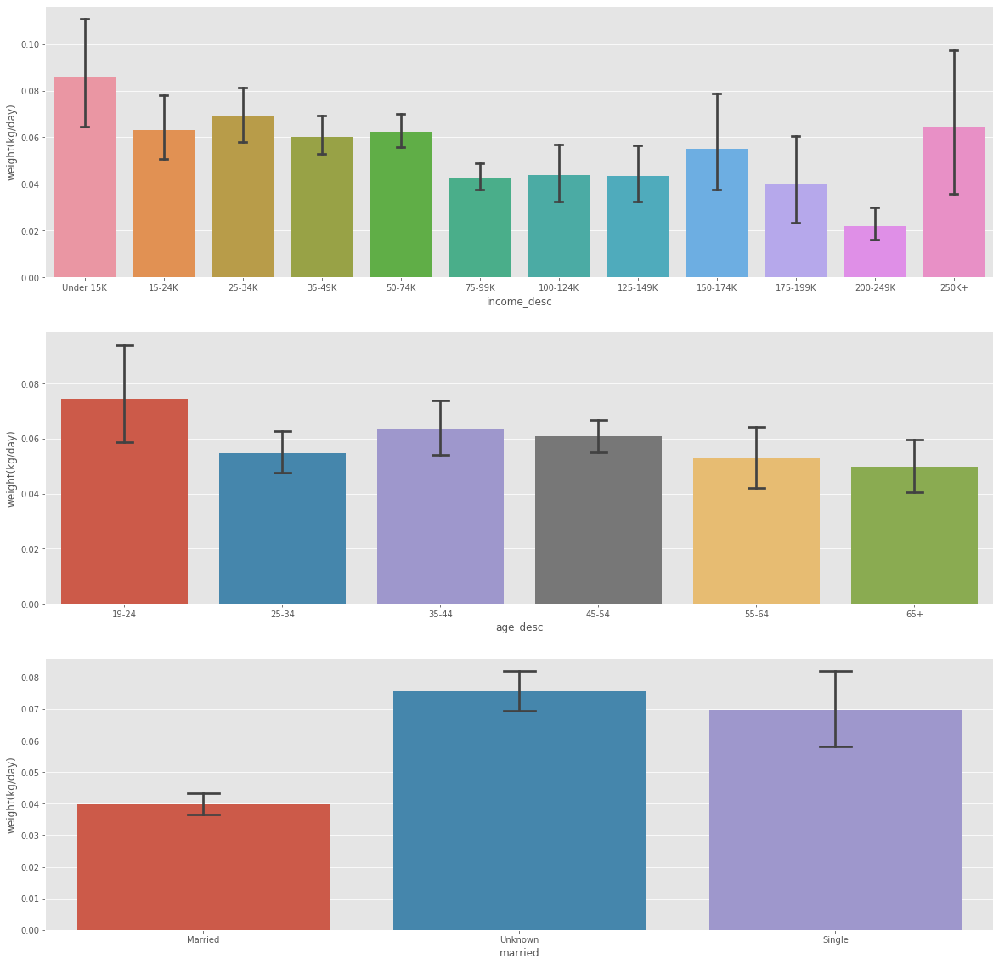

## Introduction

The consumption of everyday commodity products offers the potential to reveal societal inequalities, as well as to identify social milieus including their habits and behaviors. With transactions from more than 2500 households from different societal status over 2 years we try to identify hidden relationships and patterns. This project work will focus on two consecutive interwined aspects: societal latent structures in consumption and transaction behavior and vegetarianism.

## What kind of househould do we observe?
<iframe id="igraph" scrolling="no" style="border:none;" seamless="seamless" src="test.html" height="525" width="100%"></iframe>

## Comsumption behaviour

## Campaign and what kind of food they promote

## How do consumers react to those campaigns?
