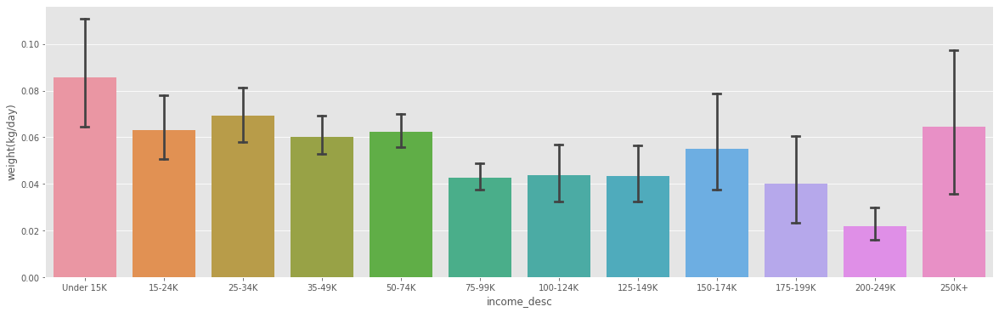
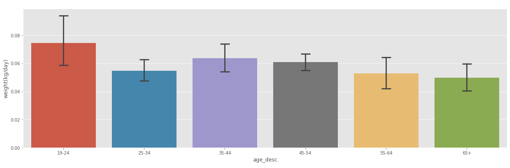
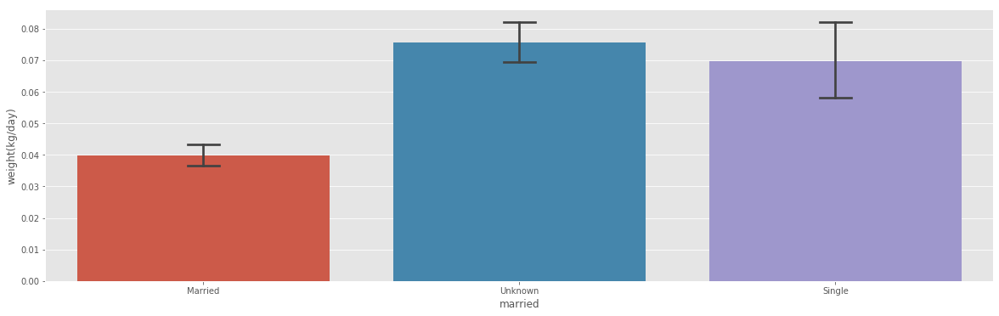
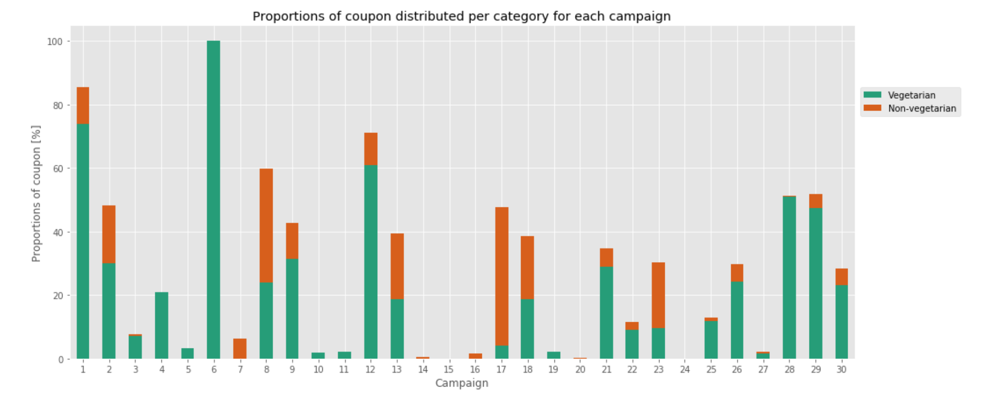
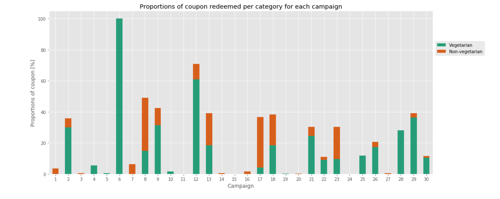

<h1>Can marketing help us being vegetarian?</h1>
<h2>A societal study identifying meat consumption patterns</h2>

>Climate change is no longer some far-off problem; it is happening here, it is happening now.
> -- <cite>[Barack Obama][1]</cite>

[1]:https://www.weforum.org/agenda/2015/11/15-quotes-on-climate-change-by-world-leaders/

...affecting our planet and our society. Hence, it is time to take the relevant steps to avoid the worst impacts of it. This concerns various dimensions, such as renewable energy, emissions and agriculture. Most importantly however is to note, that each of us is able to fight climate change. It starts off with a very simple issue: our **food consumption**. Dietary changes towards healthier diets can help to reduce the environmental impacts of the food system, in particular with regard to animal products, when they are replaced by less intensive food types [[Nature]](https://www.nature.com/articles/s41586-018-0594-0). This form of _human diet_ can actively promote a change in the amount of greenhouse-gas emissions [[Nature 572, 291-292 (2019)](https://www.nature.com/articles/d41586-019-02409-7)].

Since this project's overall goal is **"Data Science for the good"**, an analysis of our daily consumption of everyday commodity products taken from Household Transactional Data offers the potential to reveal patterns and latent structures and relations in the interaction of marketing and transaction behavior on meat and vegetarian products. With transactions from more than 2500 households from different societal status over 2 years the data set "[Dunnhumby - The complete journey](https://www.dunnhumby.com/careers/engineering/sourcefiles)", used in this analysis, offers the chance to link societal status, income and living constellations to a topic which gains more and more importance **our meat consumption**. 

Knowledge about interdependencies and drivers of customer preferences and behaviors is a crucial factor for effective customer-based strategies. Having these insights at hand, it might be possible to develop new strategies to actively take influence on improving awareness for meat consumption via more precisely targeted advertisements and promotions, satisfying both the customer himself, as well as the retail industry. For instance, a correlation of households with lower income households exhibiting a less balanced/more meat-focused food could be dispersed by placing well-suited advertisements for more vegetarian food.

## What kind of househould do we observe?
<iframe id="igraph" scrolling="no" style="border:none;" seamless="seamless" src="test.html" height="525" width="100%"></iframe>

## Consumption Behaviour

Are there differences in the meat consumption between incomes? Do people with a higher income eat more or less week per? To find out, we calculate the weight of meat, bought per household and normalize this by the number of people in the household, and the duration of data-collection for this household.

Let's look at a plot of the different income groups we have. To be able to actually say anything about the data, we also plot the 95% confidence interval.

We notice a few things: Lower income people with an income of less than 15K per year tend to buy more meat that people that earn between 75-149K. On the one hand, this seems counter-intuitive, since meat can be very expensive. On the other hand, nowadays many cheap meat products from factory farming exist. 

Include average prices of meat and other shit

Another interesting observation is that the lowest meat consumption comes from the high-income bracket of 200-249K. The consumption is significantly lower than of the beforementioned income brackets.

It seems there is an inverse relation between the income people have and their meat consumption. Possible explanations might be that higher income people buy less food in general...

Can we check this?

... or that they are more conscious about their food choices, buying for example fewer, but higher quality meats.

Can we check this?

Meat consumption is way less clear for the different age categories. In fact we can't say there is any significant difference between the age groups.

Run a test for this explicitly?

It is different for the marital status, as we can see that households of married couples eat way less meat than single person households or households were the data doesn't specify. This might be due to healthier food choices made by parents, which are more likely to occur in married households. Unfortunately, this can't be answered with confidence, due to the dataset not having detailed enough information about the number of kids.

However, if we regroup the existing data we have about adults without kids and kids vs singles, we can still see some amusing differences.

## Campaign and what kind of food they promote
Marketing plays a big role in people's grocery shopping behaviour. Are people directed to buy meat and fish? To take a look at that we observe two marketing aspects: Campaigns which distribute coupons and advertisment.

We first look at the coupons distributed by the 30 campaigns. To get an vague idea of the campaigns, we look at how many coupons they distribute and at how many coupons are actually redeemed.

<iframe id="igraph" scrolling="no" style="border:none;" seamless="seamless" src="data/campaign_overview.html" height="525" width="100%"></iframe>

We can see that the coupons do have an impact, since many of them actually get redeemed. In fact, around 86% of distributed coupons are getting redeemed. If we consider that the campaigns, and with them the coupons, are being designed by someone, we see that there is a strong influence on the buying actions of customers though the coupons.

With that in mind, let's take a closer look at the coupons and what food categories are promoted.

<iframe id="igraph" scrolling="no" style="border:none;" seamless="seamless" src="data/Campaign_proportion_food.html" height="525" width="100%"></iframe>

Do the campaigns promote meat and fish consumption?

The campaign individual shares of meat or fish related coupons are mostly low. Furthermore, vegetarian products are promoted more. It seems like campaigns do not promote meat and fish consumption. 

It is also interesting to see how many of the distributed coupons are redeemed in the end.

The proportions of distributed and redeemed coupons are quite similar. Thus, the usage rate of meat and fish coupons and vegetarian coupons are comparable aswell. We can draw the conclusion that campaigns do not direct people to buy non-vegetarian food. 

Next, we look at the other marketing aspect: advertisement. How are the different food categories advertised?

<iframe id="igraph" scrolling="no" style="border:none;" seamless="seamless" src="data/ad_types.html" height="525" width="100%"></iframe>

The best postition in a magazine is certainly the front page. Approximately 15% of all meat and only 1% of the fish products are advertised on the frontpage. On the other hand, vegetarian animal product are in 30% of the time are displayed on the frontpage. The numbers for vegetables and fruits are 10% and 7% respectively. Again, it does not appear that meat or fish is particularly advertised.

In conclusion, we can say that marketing does not promote meat and fish consumption.

## How do consumers react to those campaigns?
