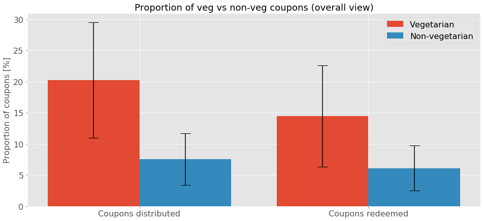

<h1>Can marketing help us being vegetarian?</h1>
<h2>A societal study identifying meat consumption patterns</h2>

>Climate change is no longer some far-off problem; it is happening here, it is happening now.
> -- <cite>[Barack Obama][1]</cite>

[1]:https://www.weforum.org/agenda/2015/11/15-quotes-on-climate-change-by-world-leaders/

...affecting our planet and our society. Hence, it is time to take the relevant steps to avoid the worst impacts of it. This concerns various dimensions, such as renewable energy, emissions and agriculture. Most importantly however is to note, that each of us is able to fight climate change. It starts off with a very simple issue: our **food consumption**. Dietary changes towards healthier diets can help to reduce the environmental impacts of the food system, in particular with regard to animal products, when they are replaced by less intensive food types [[Nature]](https://www.nature.com/articles/s41586-018-0594-0). This form of _human diet_ can actively promote a change in the amount of greenhouse-gas emissions [[Nature 572, 291-292 (2019)](https://www.nature.com/articles/d41586-019-02409-7)].

Since this project's overall goal is **"Data Science for the good"**, an analysis of our daily consumption of everyday commodity products taken from Household Transactional Data offers the potential to reveal patterns and latent structures and relations in the interaction of marketing and transaction behavior on meat and vegetarian products. With transactions from more than 2500 households from different societal status over 2 years the data set "[Dunnhumby - The complete journey](https://www.dunnhumby.com/careers/engineering/sourcefiles)", used in this analysis, offers the chance to link societal status, income and living constellations to a topic which gains more and more importance **our meat consumption**. 

Knowledge about interdependencies and drivers of customer preferences and behaviors is a crucial factor for effective customer-based strategies. Having these insights at hand, it might be possible to develop new strategies to actively take influence on improving awareness for meat consumption via more precisely targeted advertisements and promotions, satisfying both the customer himself, as well as the retail industry. For instance, a correlation of households with lower income households exhibiting a less balanced/more meat-focused food could be dispersed by placing well-suited advertisements for more vegetarian food.

## Demographic landscape of the households in the data set
<!-- <iframe id="igraph" scrolling="no" style="border:none;" seamless="seamless" src="test.html" height="525" width="100%"></iframe> -->
This data set contains 2500 households who are frequent shoppers at a retailer. It contains all of each household's purchases from a diverse number of categories (not only food-related). For certain households (801 out of 2500), also demographic information, as well as direct marketing contact history was included. This covers at least one third of the population to gain an overview of the demographic landscape of the corresponding data set. 

<iframe id="igraph" scrolling="no" style="border:none;" seamless="seamless" src="data/household_dist.html" height="525" width="100%"></iframe>

First looking at the age ranges, the biggest share (~35%) of households covers a range of 45-54 years, followed by a range of 35-44 (~25%). The smallest share is represented by the 19-24 years range, corresponding in most cases to Single Households. It can be further inferred that most of the 801 households are married or at least in partnership, which split up in nearly equally sized subgroups of having children and not having children. The third group in the marital categorization is includes Single households. It includes households from all age ranges. 

Further the demographic description provides insight in the financial situation of the households, covering a range from households earning below $15K up to $250K+, whereas the biggest group is represented by the households earning 50 to $64K, which is a roughly reasonable estimate of the "real" population. 

<iframe id="igraph" scrolling="no" style="border:none;" seamless="seamless" src="data/income_dist.html" height="525" width="100%"></iframe>

## Consumption Behaviour

Are there differences in the meat consumption between incomes? Do people with a higher income eat more or less week per? To find out, we calculate the weight of meat, bought per household and normalize this by the number of people in the household, and the duration of data-collection for this household.

Let's look at a plot of the different income groups we have. To be able to actually say anything about the data, we also plot the 95% confidence interval.

We notice a few things: Lower income people with an income of less than 15K per year tend to buy more meat that people that earn between 75-149K. On the one hand, this seems counter-intuitive, since meat can be very expensive. On the other hand, nowadays many cheap meat products from factory farming exist. However, if we check with our data, we see that meat in fact is more expensive than the rest, with a median price of $3.50, versus $2.66 for food in general. We use the median since the prices are heavy-tailed.

Another interesting observation is that the lowest meat consumption comes from the high-income bracket of 200-249K. The consumption is significantly lower than of the beforementioned income brackets.

It seems there is an inverse relation between the income people have and their meat consumption. Possible explanations might be that higher income people buy less food in general...

Can we check this?

... or that they are more conscious about their food choices, buying for example fewer, but higher quality meats.

Can we check this?

Meat consumption is way less clear for the different age categories. In fact we can't say there is any significant difference between the age groups.

Run a test for this explicitly?

It is different for the marital status, as we can see that households of married couples eat way less meat than single person households or households were the data doesn't specify. This might be due to healthier food choices made by parents, which are more likely to occur in married households. Unfortunately, this can't be answered with confidence, due to the dataset not having detailed enough information about the number of kids.

However, if we regroup the existing data we have about adults without kids and kids vs singles, we can still see some amusing differences.

## Which categories of food are being promoted during campaigns?

### The Role of Coupons

Marketing plays a big role in people's grocery shopping behaviour. Are people directed to buy meat and fish? To take a look at that we observe two marketing aspects: the discount coupons distributed during promotional campaigns and advertisement.

We first look at the coupons distributed during the 30 campaigns. To get a vague idea of the campaigns, we look at how many coupons they distribute and at how many coupons are actually redeemed. It is important to consider both the distributed and the redeemed coupons as we want to not only consider the marketing choices but also how people respond to them.

<iframe id="igraph" scrolling="no" style="border:none;" seamless="seamless" src="data/campaign_overview.html" height="525" width="100%"></iframe>

We can see that the coupons do have an impact, since many of them actually get redeemed. In fact, around 86% of distributed coupons are getting redeemed. This means coupons (and promotional campaigns in general) do have a way to influence people consumption behaviours: if many coupons are distributed for specific products and people tend to redeem them, the sales of those specific products will go up.

With that in mind, let's take a closer look at the coupons and which food categories are promoted. We display the proportions of coupons distributed in the ten categories of food previously designed. Note that the remaining parts of distributed coupons are for non-food products.

<iframe id="igraph" scrolling="no" style="border:none;" seamless="seamless" src="data/Campaign_proportion_food.html" height="525" width="100%"></iframe>

Feel free to explore what kind of food items are being promoted by the campaigns. When you're ready, continue on to find out what part meat and seafood (the non-vegetarian products) play in the campaigns.

### Promotions for Meat and Seafood

Let's have a look at the proportions of coupons distributed for vegetarian and non-vegetarian products.

We can see that the campaign individual shares of meat or seafood related coupons are mostly low. Only in 5 campaigns out of 30 the proportion of coupons distributed for non-vegetarian products is higher (campaigns 8, 13, 17, 18 and 23). It seems that campaigns tend to promote more vegetarian products, but do we have the same picture from the people point of view? Let's have a look at the proportions of coupons redeemed by the households to answer this. Here again, we have grouped products into two categories: vegetarian and non-vegetarian.

As expected, since we already know that most coupons are redeemed, the picture here is very much the same. People tend to use more coupons for vegetarian than for non-vegetarian products. 

Let's try to summarize these observations by having a more general view, looking at the average proportion of coupons distributed and redeemed for vegetarian and non-vegetarian products, across all the campaigns. We display those means with the corresponding errors at 95% confidence level. 

Since the errorbars seem to overlap (at least for the coupons redeemed) we run additional statistical tests to find out if the differences observed are significant. The proportions of coupons are the following:
<ul>
  <li>coupons distributed: 20.2 $\pm$ 9.24 % (veg) vs 7.55 $\pm$ 4.16 % (non-veg)</li>
  <li>coupons redeemed: 14.4 $\pm$ 8.12 % (veg) vs 6.11 $\pm$ 3.63 % (non-veg)</li>
</ul>

Since the assumptions of normality and equality of variances are not met by the two groups of coupons, we have run the Mann-Whitneyu's test to find out if the differences are indeed significant. The results are conclusive for the coupons distributed (U=297, p-value=0.0117 < 0.05), meaning there is a significant difference in the proportion of coupons distributed for vegetarian and for non-vegetarian products. Unfortunately this is not the case for the coupons redeemed (U=370, p-value=0.1162 > 0.05), meaning that the proportions in the two categories could in fact be similar.

---

Next, we look at the other marketing aspect: advertisement. Coupons are only half the story when the influence of the campaigns is concerned. The campaigns also distribute leaflets advertising different items. These ads can be in different parts of the leaflet. So how are the different food categories advertised?

<iframe id="igraph" scrolling="no" style="border:none;" seamless="seamless" src="data/ad_types.html" height="525" width="100%"></iframe>

The best postition in a magazine is certainly the front page. Approximately 15% of all meat and only 1% of the fish products are advertised on the frontpage. On the other hand, vegetarian animal product are in 30% of the time are displayed on the frontpage. The numbers for vegetables and fruits are 10% and 7% respectively. Again, it does not appear that meat or fish is particularly advertised.

In conclusion, we can say that it seems like marketing does not promote meat and fish consumption, but instead does so for vegetarian products.

## How do consumers react to those campaigns?
